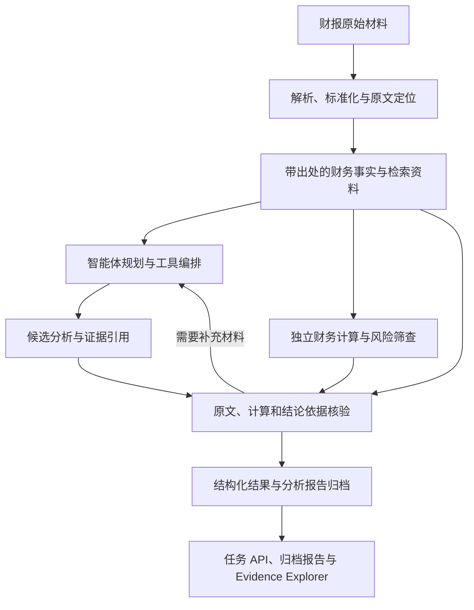

# 架构与模块边界

## 1. 当前状态和目标

文本型 PDF 的逐页解析与原文定位已经实现。`finagent.ingestion.parse_text_pdf` 读取文本型 PDF，保留文档标识、原始文件 SHA256、PDF 1-based 页序号、文字块和未旋转页面坐标。空白页与图片页不产生文字，也不执行 OCR。运行依赖为 PyMuPDF，声明在 `backend/pyproject.toml`。

旧年度预检在 `ParsedTextPdf` 上按表标题、年度表头、单位和币种提取四项年度事实，并由旧 `finance` 流程对同一指标计算报告年与上一年的差额和同比率。`scripts/extract_annual_facts.py` 读取已有 `text_pdf.json`，可选核对原始 PDF 的 SHA256，并把 `facts.json`、`calculation.json`、`summary.json` 写入新的运行目录。这不是通用财报抽取。该命令不复核引用坐标内的原文金额；这项旧式复核在年度预检中进行，仍不覆盖年度列、表头口径或完整财报事实。

v2 确定性年度分析 CLI `scripts/analyze_annual.py` 已把真实 PDF 提取、独立事实核验、年度可比性检查、计算与独立计算核验、筛查、Claim 核验及 JSON/Markdown 报告归档串成 Golden Path。海天 603288 的 2024 样例正式运行 `annual-analysis-ffcd6078-a1df-416b-88b8-6774ebe66d42` 中，8 条事实、8 项计算及 16 条确定性 Claim 均通过核验，产生 2 条 candidate 信号。可比性检查从同一报告第 116、163、197 页定位披露，在当前进程中签发绑定来源哈希与期间的 proof；序列化结果仅供审计，不能授权计算，也不表示已独立勾稽此前已披露的 2023 年报。旧回归 `tests/integration/test_haitian_v2_report.py` 仍验证未提供可比性 proof 时 `unknown` 状态必须失败关闭。M1（海天样例）与 M2（单样例确定性 Golden Path）已验收；这不代表跨公司泛化。

云端模型目前实现供应方中立的同步 Chat Completions 文本连接器，使用 `MODEL_BASE_URL`、`MODEL_API_KEY` 和 `MODEL_NAME`。请求只含 `model`、`messages` 和 `stream=false`。`finagent.audit.audited_complete_chat` 把脱敏请求、成功或失败记录写入本次运行目录的 UUID 子目录。默认供应方和型号仍未选定。M3 调查流程已使用 LangGraph StateGraph、同源年报限量检索及该审计调用，并由 `scripts/analyze_annual.py --with-model --source-record ...` 选择性接入；LangGraph 1.2.12 的本地 mock 集成测试已通过。LangGraph 1.2.12 通过 agents 可选依赖声明。2026-09-28 已对海天 603288 2024 样例完成 DeepSeek 官方直连单例验收，运行 `annual-analysis-a32c16a7-00da-48c5-a97d-59ee284904df` 归档两个候选的未核实解释；首轮预算分配缺陷及评估见 `artifacts/evaluations/deepseek-live-m3-603288-20260928-a32c16a7/`。这不代表跨公司能力、人工 golden 或默认供应商选择。

本地 FastAPI 同时提供旧年度财务预检和 v2 年度分析任务。旧接口为 `POST /v1/annual-prechecks` 与 `GET /v1/annual-prechecks/{run_id}`；v2 任务接口为 `POST /v1/annual-analysis-jobs` 与 `GET /v1/annual-analysis-jobs/{job_id}`，状态持久化在 `artifacts/annual-analysis-jobs/<job_id>/job.json`。任务从 `data/raw` 已存 PDF 启动现有 CLI，支持 deterministic 和 M3 筛查；默认单进程一个运行任务、三个排队任务，重启后遗留的 queued/running 状态标为 `interrupted`。请求校验路径边界、符号链接、`source.json` 的公司/年度/文档绑定和 SHA256。`model_investigation` 明确返回不支持。只读报告 `GET /v1/annual-analyses/{run_id}` 与证据页图 `GET /v1/annual-analyses/{run_id}/evidence/{evidence_id}/preview.png` 保持原行为。应用本身不强制 host；按文档中的 Uvicorn 命令默认绑定 `127.0.0.1`。项目无用户注册、登录或账户管理，且不在当前项目范围。模型供应方的 API 密钥仍是独立配置，旧预检不读取它。旧预检在哈希一致后，从原始 PDF 的引用坐标重新读取金额，并独立复核单位换算。这尚未确认年度列、表头口径或完整财报事实，也不是 Agent 风险判断。旧预检记录中的 `screening` 是可选的确定性候选线索；它不改变预检 `status`，`model_called` 与 `independently_verified` 仍为 false。页面在记录含有该字段时展示线索，并明确提示缺失的历史记录未保存 screening。新的旧流程预检归档包含 `code` 和 `verification`。`annual-precheck-603288-2024-20260923-160938` 没有这两项，保持原样。把同一行空格与负号、括号、千分位一并计入金额边界的正式运行是 `annual-precheck-603288-2024-20260923-165111`。`164542`、`163707`、`163126` 和 `160938` 仍保留。

旧版确定性候选筛查写入旧预检的 `screening`，只表示规则命中的线索或弃权。后端还提供文本 PDF 上传与解析，创建页上传成功后填入路径，仍需用户另行创建旧预检。旧预检页面继续读取旧流程记录；独立的 v2 年度分析页已接入 PDF 上传、本机样例启动、任务状态恢复与重试、确定性/M3 试行筛查，以及成功后同一 run_id 的归档报告和独立核验证据页图；仍可按 run_id 回看旧归档。报告为候选线索和待核查事实、计算、主张就近列出关联指标的 PDF 物理页序号，仅同源、独立核验通过且在预览白名单中的证据可以打开页图；未经核实的提取位置标为“待核实定位”，无法可靠定位时显示“原文位置待定位”。页码只定位原文位置，不改变候选线索或待核查对象的核验状态。M3 四规则与已核验事实分开呈现，M3 字段缺失的旧报告正常隐藏该区块。页面不提供产品级导出；M3 可选模型调查流程已于 2026-09-28 完成海天样例单例在线验收，仍未形成跨公司验证或人工 golden。多公司人工 golden 与完整多公司可靠性评测仍待完成；单公司有/无核验消融基线见下文。下文对目标模块边界的描述同时标明已实现能力与未完成集成。

目标是完成财报导入、财务分析、独立计算、证据核验及报告生成，提供财务异常和舞弊风险线索。第一阶段围绕可解释、可计算的财报问题展开，具体公司、行业和模型在开发阶段选定。

第一版方案详见 [修订大纲](../submission/proposal/多智能体协同财务欺诈识别方案总结大纲_修订版.docx)。优先覆盖口径可比的非金融上市公司文本型财报，先完成同比环比、非经常性损益、会计口径变化和利润现金流差异分析，再形成异常线索；特殊金融行业和复杂扫描件暂不纳入通用自动分析承诺。

技术方向确定为“云端 API + 本地轻量 Web + 本地统计计算”：React + TypeScript + Vite 前端、Python + FastAPI 后端在本机运行；LangGraph 作为第一版唯一的智能体编排框架；后端通过 API 调用云端模型。文本连接器兼容 Qwen、DeepSeek、OpenAI 的 Chat Completions 共有子集，具体供应方和型号由环境变量决定，项目没有内置默认值。文本型 PDF 解析使用 PyMuPDF。财务公式、统计筛查与数值核验由本地 Python 执行，第一版不部署或训练本地模型，不要求 GPU。最终展示是本机 localhost Web。先用 `uvicorn finagent.api.app:app --host 127.0.0.1 --port 8000` 启动后端；再由用户在 `frontend/` 安装已声明的 npm 依赖并执行 `npm run dev`。Vite 绑定 `127.0.0.1:5173`，把 `/api` 代理到 `127.0.0.1:8000`。浏览器打开 http://127.0.0.1:5173 。本机已执行 `npm install` 并生成 `frontend/package-lock.json`，`npm run typecheck` 与 `npm run build` 已通过。开发服务上的浏览器验收覆盖首页、海天 2024 样例创建、按 `run_id` 回看和错误提示，创建记录为 `annual-precheck-603288-2024-20260923-192840`。克隆后仍需自行安装依赖。浏览器不持有模型密钥。

原始文件、解析结果、检索索引和审计记录保存在本地。云端请求只携带允许外发且与任务有关的证据片段；第一版检索限定本次运行的材料清单，不开放任意互联网检索。模型端点、调用预算、超时和重试上限在实现时配置。现场云端 API 访问是否允许仍待组委会环境说明核实，历史回放不得作为实时处理能力的证明。

## 2. 数据流

- 智能体根据任务检索正文、附注和结构化事实，并调用已有工具。
- 财务计算使用带来源的结构化数据和可复现公式；不能依赖大模型在自然语言中给出的计算结果。
- 核验需要回到原始出处。不同模块复用同一个错误提取值时，数值一致不能证明其正确。
- 目标流程是提取、事实核验、确定性计算与筛查、解释与调查、主张核验、报告。补充检索最多一次。v2 独立事实、计算与 Claim 核验以及可比性检查已进入正式 CLI；海天样例中 8 条事实、8 项计算和 16 条确定性 Claim 均验证通过。可比性 proof 来自当前报告第 116、163、197 页，仅在签发它的进程内授权计算，序列化副本仅作审计；尚未独立勾稽此前已披露的 2023 年报。旧预检的坐标金额复核仍只检查金额是否出现在给定区域内及单位换算，状态为 `passed`、`failed`、`abstained`。模型自评不能代替独立核验，未验证内容进入待核查区。
- 可以通过补充材料解决的问题进入有上限的重新检索与核验循环；达到上限、原文不可读或关键口径仍冲突时转人工复核。未解决的主张不能写为已核实结论，报告保留缺口和失败状态。
- 证据不足、提取失败或口径冲突应在结果中明确暴露，避免强行生成确定结论。
- 文件访问、工具调用、计算、核验与输出环节均由 audit 记录，运行记录按 run_id 归档。
- 事实、推论、观点及待核查事项需要区分，统计信号不能直接作为确认舞弊的判定。

## 3. 前端与后端职责

前端仅负责交互和展示，不保存服务端模型密钥或实现独立的财务计算口径。

| 前端目录 | 职责 |
| --- | --- |
| frontend/public/ | 正式静态资源 |
| frontend/src/pages/ | 默认入口和主导航为“分析年报”，可启动正式 v2 年度分析、恢复或重试任务，并查看归档报告与已核验证据页图。旧年度预检位于“基础预检（旧流程）”单独分组，保留预检说明、新建预检和结果页面；新建页上传文本 PDF 后仍需另行创建预检，结果页展示旧记录中的事实、同比、引用页、金额复核和可选 screening，缺少该字段的历史记录会明确显示未保存。旧报告占位已从主导航移除。M3 规则线索与核验事实分开呈现，页面不提供产品级导出 |
| frontend/src/components/ | 公共界面组件 |
| frontend/src/api/ | 与后端的请求、响应及错误处理 |
| frontend/src/types/ | 前端数据类型 |
| frontend/src/styles/ | 页面及公共样式 |

后端业务代码位于 backend/src/finagent/：

| 模块 | 职责与边界 |
| --- | --- |
| api | 本地 HTTP 接口，不直接堆放分析公式。旧年度预检有创建、按 run_id 读取及 `POST /v1/text-pdf-uploads`。v2 有 `POST /v1/annual-analysis-jobs` 与 `GET /v1/annual-analysis-jobs/{job_id}`，启动并查询现有 CLI 的 deterministic/M3 筛查任务；只读 `GET /v1/annual-analyses/{run_id}` 和按独立核验证据生成页图的 `GET /v1/annual-analyses/{run_id}/evidence/{evidence_id}/preview.png` 保持不变。任务状态写入 `artifacts/annual-analysis-jobs/`，一个进程运行一个任务并最多排队三个，重启时未完成任务显示 `interrupted`；模型调查模式显式不支持。创建页上传后仍需另行创建旧预检；项目不包含用户注册、登录或账户管理 |
| agents | LangGraph 年度调查 StateGraph、候选解释、调用审计、同源检索及最多一次补充检索已编码，并由 CLI 的可选 `--with-model --source-record` 路径接入。`langgraph` 属于 `agents` 可选依赖，LangGraph 1.2.12 已安装，5 项本地 mock 集成测试通过；已完成海天单例在线调用验收（评估 ID：deepseek-live-m3-603288-20260928-a32c16a7） |
| ingestion | 文档解析、字段提取、单位与报告口径标准化，保留原文位置。已实现文本型 PDF 逐页文字、四项旧年度事实提取及适配到 v2 事实；v2 资产负债表切片提取应收账款净额和存货净额，利润表切片提取合并净利润和营业成本，主要会计数据切片提取扣非归母净利润。切片保留报告年/比较年、单位币种、来源哈希和证据位置，均通过海天真实 PDF 与构造 PDF 测试。扣非归母净利润从 PDF 第 7 页“主要会计数据”表按年份表头位置提取，排除同比百分比列，并使用 `statement_type=key_financial_data`、`scope=unknown`；五类字段由 CLI 的显式可选 `--with-m3-screening` 路径提取并独立核验，默认 M2 结构和旧筛查不变 |
| retrieval | 已实现针对当前年度报告 PDF 的确定性正文与附注片段检索，绑定文档标识、来源哈希、PDF 页码、坐标和证据 ID，并限制片段数与字符数；检索最多补充一次。它不开放任意互联网检索，也不使用评测标签 |
| tools | 将已有解析、检索、计算等能力适配为智能体可调用工具，避免复制业务实现 |
| finance | 确定性指标计算、财务规则、统计筛查与候选风险评分。旧流程已实现四项事实的年度差额和同比率及 `screen_annual_signals`。v2 年度计算和 `screen_v2_annual_candidates` 已进入正式 CLI；海天样例的 8 项计算均经独立重算核验为 `verified`，并产生 2 条 candidate 信号。另有独立 `m3_screening.py` 四规则试行模块：利润/现金流背离、扣非归母占比、应收账款净额与营收增速差、存货净额与营业成本增速差；阈值显式标为试行，每条计 25 分，任一项不可计算则总分弃权。四规则已由 `--with-m3-screening` 显式接入 CLI；海天正式运行 `annual-analysis-5e7079fe-9ac9-4e96-85fa-1898f9177d21` 四条均可计算且总分为 0。默认 M2 与旧筛查不变，阈值仍为试行值。海天结果不代表跨公司验证；非正比较基数、未知/冲突/重复事实及不匹配来源或口径均失败关闭 |
| verification | 原文、字段、公式、引用及结论证据的核验。旧流程已实现按原始 PDF 引用坐标复核金额并用独立 Decimal 复核单位换算；v2 正式 CLI 独立核验海天样例的 8 条事实、年度可比性和 8 项计算，并对 16 条确定性 Claim 做结构与支持证据检查。新增资产负债表和利润表字段核验会独立重读原 PDF，检查列、期间、币种、金额、口径与比较角色。扣非归母净利润核验重新读取原 PDF，以独立字词坐标匹配“主要会计数据”行及 2024、2023、2022 三年表头，排除同比百分比栏，验证精确金额、年度期间、币种和角色；事实类型为 `key_financial_data`，scope 保持 `unknown`。规则二另有专属语义映射 helper：只允许海天 603288 2024 年报物理第 7 页版式，重定位“归属于上市公司股东的净利润”并与合并利润表归母净利润的当前年、比较年金额逐期核对；proof 绑定源哈希、文档、报告年、两年事实和值及页 7 重定位区域，由当前进程签名，审计 JSON 不授权重用。四规则入口的调用约定是接收同一进程 `verify_financial_fact` 的直接结果，核验 evidence ID 必须与提取 evidence ID 不相交；`VerificationResult` 本身不是签名 proof，反序列化 JSON 或手工重建对象都不能作为验收凭据。该签名语义映射仅支持所述样例版式，不是跨公司通用能力 |
| reports | 已实现 v2 JSON 年度报告组装和 Markdown 渲染；真实海天样例报告已由正式 CLI 归档到 `artifacts/reports/<run_id>/`，与 `artifacts/runs/<run_id>/` 共用 run_id。报告含 8 条已核验事实、8 项已核验计算、16 条已核验 Claim 和 2 条候选信号。独立 v2 页面可上传或选择本机样例启动任务，读取任务状态并在成功后打开同一 run_id 的报告及证据；也可回看归档，暂无产品级导出 |
| schemas | 文档、财务事实、证据、分析任务和结果等共用类型。除旧 `FinancialFact` 外，v2 已有财务事实、`TableCellEvidence`、核验、计算与 Claim 类型，并由正式年度分析 CLI 串联；任务状态由 `api/annual_analysis_jobs.py` 持久化为 JSON，报告读取与 Evidence Explorer 已接入 |
| llm | 后端供应方中立的同步 Chat Completions 纯文本调用；M3 调查流程已从可选 CLI 路径调用该连接器。候选根地址见 README，北京和新加坡使用工作空间专属域名，协议限于三家共有字段。默认供应方和型号未选定，当前没有在线调用验收 |
| audit | 文件访问、工具调用、计算及生成过程记录，处理敏感凭据。`audited_complete_chat` 接收 `artifacts/runs` 的直接子目录、带 `document_id` 与 PDF 页码的 `evidence_refs`、`prompt_version`；联网前写入 `started`，成功写入 `succeeded`，失败只写安全类别，不记录 `base_url`、请求头或异常原文。M3 流程已调用该包装器；海天单例在线验收的两次请求均有对应审计记录 |
| core | 配置、路径、公共异常等基础能力 |

依赖清单和构建配置分别归属 frontend/ 和 backend/。`backend/pyproject.toml` 已声明 PyMuPDF、FastAPI 和 Uvicorn，测试可选依赖包含 httpx；`langgraph>=1.2,<1.3` 通过可选的 `agents` extra 声明，本机验收使用 1.2.12。`frontend/package.json` 已声明页面依赖的精确版本，本机 `npm install` 已生成 `frontend/package-lock.json`。`node_modules` 不纳入 Git。LangGraph 是第一版唯一的智能体编排框架。

## 4. 其他目录的职责

| 目录 | 职责 |
| --- | --- |
| config/prompts/ | 可版本化的提示词 |
| config/rules/ | 财务规则、阈值、适用条件和计算口径配置 |
| data/raw/ | 保持原样的原始输入 |
| data/processed/ | 解析文本、表格、标准化事实和可重建索引 |
| data/samples/ | 具备明确来源和使用条件的演示样例 |
| artifacts/runs/ | 按运行归档的输入引用、执行记录与必要中间结果 |
| artifacts/reports/ | 生成的报告与导出 |
| artifacts/annual-analysis-jobs/ | 异步年度分析任务状态与结果指针 |
| artifacts/evaluations/ | 评测运行结果 |
| evaluation/cases/ | 案例清单、人工标注与评测标签 |
| evaluation/baselines/ | 仅大模型、仅规则或统计模块等对照评测实现 |
| tests/unit/ | 单模块测试。已覆盖文本型 PDF 解析、四项事实提取和年度同比；核验规则测试随核验模块编写 |
| tests/integration/ | 解析、检索、计算、核验等协作测试 |
| tests/e2e/ | 上传到报告输出的完整流程测试 |
| scripts/ | 可复用的工程操作脚本 |
| submission/proposal/ | 初赛计划书及可编辑源文件 |
| submission/video/ | 视频脚本及提交视频 |
| submission/final/ | 决赛报告及最终交付材料 |

模块内临时内容进入所属目录的 tmp/<task_id>/；跨模块临时内容进入 artifacts/tmp/<task_id>/。已有临时目录和文件默认保留，任务结束不主动清理。正式流程不依赖临时目录。

## 5. 接口与类型的规划边界

旧年度预检业务类型包括文本型 PDF 解析结果和 `FinancialFact`，分别在 `backend/src/finagent/schemas/text_pdf.py` 与 `financial_fact.py`。隔离的 v2 schema 还包含新的财务事实、表格单元格证据、核验、计算和 Claim 类型；任务状态由 API 模块持久化为 JSON。HTTP 路由包含旧流程 `POST /v1/text-pdf-uploads`、`POST /v1/annual-prechecks`、`GET /v1/annual-prechecks/{run_id}`，v2 任务 `POST /v1/annual-analysis-jobs`、`GET /v1/annual-analysis-jobs/{job_id}`，只读的 `GET /v1/annual-analyses/{run_id}` 和已核验证据页图预览 GET。任务 API 调用现有 `scripts/analyze_annual.py`，不改变旧预检流程。确定性 M3 四规则通过独立可选 `--with-m3-screening` 路径运行，并已归档海天单样例 `annual-analysis-5e7079fe-9ac9-4e96-85fa-1898f9177d21`；默认路径维持 M2 行为。M3 调查流程另由 `--with-model --source-record` 选择；海天单例在线验收已完成，运行 `annual-analysis-a32c16a7-00da-48c5-a97d-59ee284904df` 归档两条未核实解释，评估见 `artifacts/evaluations/deepseek-live-m3-603288-20260928-a32c16a7/`。该单例不代表跨公司能力、人工 golden 或独立核验；两种 M3 选项暂不支持同一次运行。字段缺口见 [current-schema-audit.md](current-schema-audit.md)，路线见 [roadmap.md](roadmap.md)。

旧年度预检的创建、按 run_id 读取和页面展示已经接上现有接口。创建页已接文本 PDF 上传，上传后仍需另一次旧预检。v2 报告归档由 CLI 写入 `artifacts/reports/<run_id>/`；v2 年度分析页面已接入任务启动与进度展示、刷新后恢复 job_id、失败/中断重试、成功后读取同一 run_id 的报告和证据，以及按 run_id 回看归档。旧年度预检创建页仍保持原有分步流程。产品级报告导出仍未实现。

财务事实至少需要表达原始出处、数值、单位、币种、报告期和报表口径；核验结果需要表达检查对象、依据与状态。确切类型定义集中在 schemas，避免各模块各自维护不一致的字段。

## 6. 开发与验证顺序

软件开发范围是可运行系统、数据、核验和复现说明。初赛计划书 PDF 和项目介绍视频 MP4 不在本开发任务内。`submission/` 仍保留比赛材料；比赛对计划书和视频的客观要求不变。本文不指定这些材料的完成人，已有比赛资料保持原样。

1. 文本型 PDF 的逐页文字与坐标已实现，并已用公开年报样例做过定位验收。
2. 旧流程的四项年度事实、确定性同比和引用坐标内的原文金额复核已实现。v2 确定性 Golden Path 已通过正式 CLI 在海天 2024 样例验收，并归档 8 条独立核验事实、8 项独立核验计算、16 条通过确定性检查的 Claim 和 2 条候选信号。M1、M2 对该样例已验收；可比性结论只依据当前年报披露，没有独立勾稽此前已披露的 2023 年报，也不代表跨公司泛化。
3. M3 年报内调查、LangGraph、提示词与审计调用已编码并接入 CLI 可选路径；LangGraph 1.2.12 的本地 mock 集成测试通过；已完成海天单例在线调用验收（评估 ID：deepseek-live-m3-603288-20260928-a32c16a7）。
4. 旧年度预检接口和页面已在开发服务上验收；v2 年度分析页面已接入 PDF 上传、海天样例启动、任务阶段展示、job_id 恢复与重试，并在成功后显示同一 run_id 报告和独立核验证据预览；也保留按 run_id 回看归档。2026-09-28 Chrome headless smoke 从页面启动海天样例 job annual-job-f585b9c64c064ec48b12e038dd6a00e1 并自动读取 run annual-analysis-b788f884-e66d-4374-a2a7-2b5283ca4b44；随后读取 M3 归档 annual-analysis-5e7079fe-9ac9-4e96-85fa-1898f9177d21，四条规则与 issues 数组正常显示。暂无产品级导出。按文档先启动绑定 127.0.0.1 的后端，再启动 Vite。后端文本 PDF 上传、页面上传与旧预检仍是分开的步骤；项目不包含用户注册、登录或账户管理。
5. 评测与复现说明：使用相同输入比较各方案，记录准确性、查准率、召回率、引用正确性和稳定性。

2026-09-28 已建立首个可复现的 M4 有/无独立核验消融基线。脚本 `scripts/evaluate_verification_ablation.py` 使用真实海天 603288 2024 年报及其正式归档事实，协议位于 `evaluation/verification_ablation_cases_v1.json`，运行 `verification-ablation-m4-20260928T072029Z-825a8c4b` 归档在 `artifacts/evaluations/verification-ablation-m4-20260928T072029Z-825a8c4b/`。独立核验支路在 7 个文档直接参考/合成标签上正确接受 2/2 个 clean 案例、拒绝 5/5 个注入错误；无核验支路接受 5/5 个注入错误。茅台与五粮液 provisional 案例只用于状态对照，排除在已知标签统计之外。clean 值由 agent 从原 PDF 第 81 页转录，尚未经人工审核；该基线不代表 3–5 家人工 golden、舞弊识别准确率或完整 M4 验收。

旧流程和 v2 的单元/集成检查覆盖 PDF 解析、事实提取、可比性、计算、报告读取及调查逻辑。`tests/integration/test_annual_investigation_mock.py` 使用可选 LangGraph 依赖测试调查图、调用审计和一次补充检索；该依赖已安装，此 mock 集成测试 5 项均通过。M3 四规则由 `tests/unit/test_m3_screening.py` 覆盖精确阈值边界、缺失/重复/冲突事实、单位、币种、公司、来源、期间、非正基数、核验 evidence ID 重用和语义 proof 伪造；`tests/integration/test_haitian_m3_screening.py` 将五类 v2 字段、独立事实核验、年度可比性 proof、规则二页 7 跨表 proof 与真实海天 PDF 串联，四条均可计算且未触发。CLI 集成测试还检查默认 M2 数量不变、M3 归档与失败弃权、报告读取函数及只读 GET 路由；正式海天 M3 运行 `annual-analysis-5e7079fe-9ac9-4e96-85fa-1898f9177d21` 已归档。v2 字段切片的错误注入还覆盖资产负债表、利润表、主要会计数据；利润表字段定位营业成本第 81 页、合并净利润第 82 页，扣非归母净利润切片排除同比百分比列并保持 `scope=unknown`。`tests/integration/test_cross_company_annual_facts.py` 覆盖海天、茅台和五粮液三份真实年报，但不构成多公司人工 golden 或泛化验收。五粮液 `0.00` Decimal 修复后的正式 CLI run `annual-analysis-956db60d-6595-4d7c-8277-07d1d7e21326` 已归档；可比性为 `insufficient_evidence`，8 条事实币种未明确而未确认，8 项计算未确认，2 条筛查均弃权，案例仍待人工审阅。前端没有单独的自动化测试套件；npm run typecheck 与 npm run build 已通过，旧预检页面也有既有浏览器验收记录。2026-09-28 的 390px 浏览器检查无横向溢出，中文 PDF 选择控件支持键盘焦点与可见焦点样式；截图留在 frontend/tmp/annual-job-frontend-smoke/。
