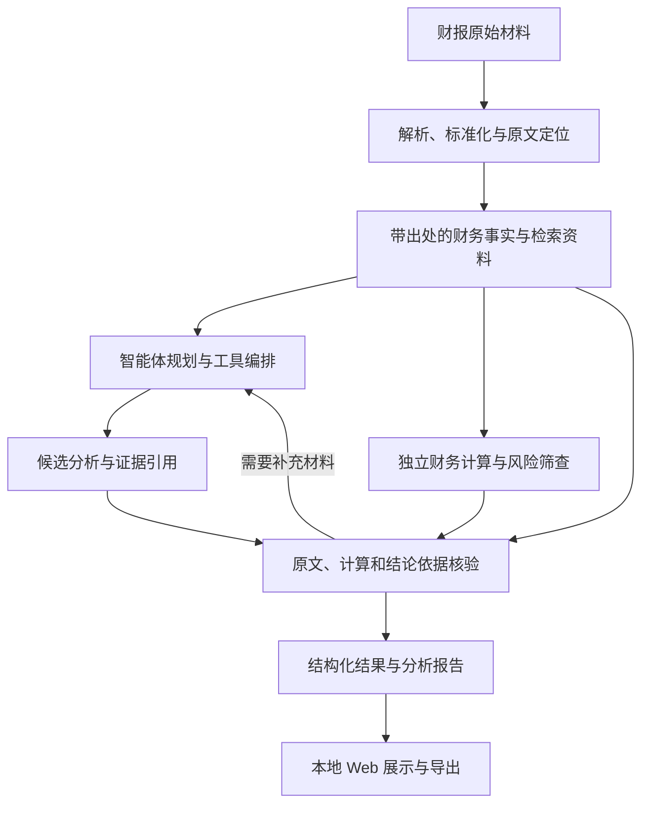

# 架构与模块边界

## 1. 当前状态和目标

文本型 PDF 的逐页解析与原文定位已经实现。`finagent.ingestion.parse_text_pdf` 读取文本型 PDF，保留文档标识、原始文件 SHA256、PDF 1-based 页序号、文字块和未旋转页面坐标。空白页与图片页不产生文字，也不执行 OCR。运行依赖为 PyMuPDF，声明在 `backend/pyproject.toml`。

旧年度预检在 `ParsedTextPdf` 上按表标题、年度表头、单位和币种提取四项年度事实，并由旧 `finance` 流程对同一指标计算报告年与上一年的差额和同比率。`scripts/extract_annual_facts.py` 读取已有 `text_pdf.json`，可选核对原始 PDF 的 SHA256，并把 `facts.json`、`calculation.json`、`summary.json` 写入新的运行目录。这不是通用财报抽取。该命令不复核引用坐标内的原文金额；这项旧式复核在年度预检中进行，仍不覆盖年度列、表头口径或完整财报事实。

v2 确定性年度分析 CLI `scripts/analyze_annual.py` 已把真实 PDF 提取、独立事实核验、年度可比性检查、计算与独立计算核验、筛查、Claim 核验及 JSON/Markdown 报告归档串成 Golden Path。海天 603288 的 2024 样例正式运行 `annual-analysis-ffcd6078-a1df-416b-88b8-6774ebe66d42` 中，8 条事实、8 项计算及 16 条确定性 Claim 均通过核验，产生 2 条 candidate 信号。可比性检查从同一报告第 116、163、197 页定位披露，在当前进程中签发绑定来源哈希与期间的 proof；序列化结果仅供审计，不能授权计算，也不表示已独立勾稽此前已披露的 2023 年报。旧回归 `tests/integration/test_haitian_v2_report.py` 仍验证未提供可比性 proof 时 `unknown` 状态必须失败关闭。M1（海天样例）与 M2（单样例确定性 Golden Path）已验收；这不代表跨公司泛化。

云端模型目前实现供应方中立的同步 Chat Completions 文本连接器，使用 `MODEL_BASE_URL`、`MODEL_API_KEY` 和 `MODEL_NAME`。请求只含 `model`、`messages` 和 `stream=false`。`finagent.audit.audited_complete_chat` 在此之外把脱敏请求、成功或失败记录写入本次运行目录的 UUID 子目录。默认供应方和型号仍未选定。该包装器尚未接到智能体或年度预检。已确认先完成本地实现和模拟接口测试；真实在线模型验收等用户配置后再做。不读取其他工具的密钥，也不自行选定供应方。

本地 FastAPI 当前仍提供旧年度财务预检：`POST /v1/annual-prechecks` 与 `GET /v1/annual-prechecks/{run_id}`；v2 确定性分析通过独立 CLI 启动，尚无 v2 HTTP API。应用本身不强制 host；按文档中的 Uvicorn 命令默认绑定 `127.0.0.1`。项目无用户注册、登录或账户管理，且不在当前项目范围。模型供应方的 API 密钥仍是独立配置，旧预检不读取它。旧预检在哈希一致后，从原始 PDF 的引用坐标重新读取金额，并独立复核单位换算。这尚未确认年度列、表头口径或完整财报事实，也不是 Agent 风险判断。旧预检记录中的 `screening` 是可选的确定性候选线索；它不改变预检 `status`，`model_called` 与 `independently_verified` 仍为 false。页面在记录含有该字段时展示线索，并明确提示缺失的历史记录未保存 screening。新的旧流程预检归档包含 `code` 和 `verification`。`annual-precheck-603288-2024-20260923-160938` 没有这两项，保持原样。把同一行空格与负号、括号、千分位一并计入金额边界的正式运行是 `annual-precheck-603288-2024-20260923-165111`。`164542`、`163707`、`163126` 和 `160938` 仍保留。

旧版确定性候选筛查写入旧预检的 `screening`，只表示规则命中的线索或弃权。后端还提供文本 PDF 上传与解析，创建页上传成功后填入路径，仍需用户另行创建旧预检。本地页面只展示旧年度预检，不读取 v2 报告。v2 确定性分析已有正式 CLI 和同 `run_id` 的运行/报告归档，但尚未接入旧预检 API 或页面。LangGraph 编排、模型解释、年报内检索、Evidence Explorer、多公司 golden 与产品级 v2 报告展示/导出仍待实施。下文对目标模块边界的描述同时标明已实现能力与未完成集成。

目标是完成财报导入、财务分析、独立计算、证据核验及报告生成，提供财务异常和舞弊风险线索。第一阶段围绕可解释、可计算的财报问题展开，具体公司、行业和模型在开发阶段选定。

第一版方案详见 [修订大纲](../submission/proposal/多智能体协同财务欺诈识别方案总结大纲_修订版.docx)。优先覆盖口径可比的非金融上市公司文本型财报，先完成同比环比、非经常性损益、会计口径变化和利润现金流差异分析，再形成异常线索；特殊金融行业和复杂扫描件暂不纳入通用自动分析承诺。

技术方向确定为“云端 API + 本地轻量 Web + 本地统计计算”：React + TypeScript + Vite 前端、Python + FastAPI 后端在本机运行；LangGraph 作为第一版唯一的智能体编排框架；后端通过 API 调用云端模型。文本连接器兼容 Qwen、DeepSeek、OpenAI 的 Chat Completions 共有子集，具体供应方和型号由环境变量决定，项目没有内置默认值。文本型 PDF 解析使用 PyMuPDF。财务公式、统计筛查与数值核验由本地 Python 执行，第一版不部署或训练本地模型，不要求 GPU。最终展示是本机 localhost Web。先用 `uvicorn finagent.api.app:app --host 127.0.0.1 --port 8000` 启动后端；再由用户在 `frontend/` 安装已声明的 npm 依赖并执行 `npm run dev`。Vite 绑定 `127.0.0.1:5173`，把 `/api` 代理到 `127.0.0.1:8000`。浏览器打开 http://127.0.0.1:5173 。本机已执行 `npm install` 并生成 `frontend/package-lock.json`，`npm run typecheck` 与 `npm run build` 已通过。开发服务上的浏览器验收覆盖首页、海天 2024 样例创建、按 `run_id` 回看和错误提示，创建记录为 `annual-precheck-603288-2024-20260923-192840`。克隆后仍需自行安装依赖。浏览器不持有模型密钥。

原始文件、解析结果、检索索引和审计记录保存在本地。云端请求只携带允许外发且与任务有关的证据片段；第一版检索限定本次运行的材料清单，不开放任意互联网检索。模型端点、调用预算、超时和重试上限在实现时配置。现场云端 API 访问是否允许仍待组委会环境说明核实，历史回放不得作为实时处理能力的证明。

## 2. 数据流

- 智能体根据任务检索正文、附注和结构化事实，并调用已有工具。
- 财务计算使用带来源的结构化数据和可复现公式；不能依赖大模型在自然语言中给出的计算结果。
- 核验需要回到原始出处。不同模块复用同一个错误提取值时，数值一致不能证明其正确。
- 目标流程是提取、事实核验、确定性计算与筛查、解释与调查、主张核验、报告。补充检索最多一次。v2 独立事实、计算与 Claim 核验以及可比性检查已进入正式 CLI；海天样例中 8 条事实、8 项计算和 16 条确定性 Claim 均验证通过。可比性 proof 来自当前报告第 116、163、197 页，仅在签发它的进程内授权计算，序列化副本仅作审计；尚未独立勾稽此前已披露的 2023 年报。旧预检的坐标金额复核仍只检查金额是否出现在给定区域内及单位换算，状态为 `passed`、`failed`、`abstained`。模型自评不能代替独立核验，未验证内容进入待核查区。
- 可以通过补充材料解决的问题进入有上限的重新检索与核验循环；达到上限、原文不可读或关键口径仍冲突时转人工复核。未解决的主张不能写为已核实结论，报告保留缺口和失败状态。
- 证据不足、提取失败或口径冲突应在结果中明确暴露，避免强行生成确定结论。
- 文件访问、工具调用、计算、核验与输出环节均由 audit 记录，运行记录按 run_id 归档。
- 事实、推论、观点及待核查事项需要区分，统计信号不能直接作为确认舞弊的判定。

## 3. 前端与后端职责

前端仅负责交互和展示，不保存服务端模型密钥或实现独立的财务计算口径。

| 前端目录 | 职责 |
| --- | --- |
| frontend/public/ | 正式静态资源 |
| frontend/src/pages/ | 单页旧年度预检仪表盘：首页、创建、结果、报告四个视图。摘要数字只来自已加载的旧预检记录。结果页展示记录中可选的旧版 screening，并标明历史记录缺少该字段；报告视图尚未接入 v2 报告组装结果，也没有正式生成与导出入口。创建页可上传文本 PDF，不自动预检。任务进度尚未实现 |
| frontend/src/components/ | 公共界面组件 |
| frontend/src/api/ | 与后端的请求、响应及错误处理 |
| frontend/src/types/ | 前端数据类型 |
| frontend/src/styles/ | 页面及公共样式 |

后端业务代码位于 backend/src/finagent/：

| 模块 | 职责与边界 |
| --- | --- |
| api | 本地 HTTP 接口，不直接堆放分析公式。已实现旧年度预检的创建和按 run_id 读取，以及 `POST /v1/text-pdf-uploads`。上传只写入新的文档目录并调用已有文本解析，不调用模型，也不代替预检。创建页已提供文本 PDF 上传，没有单独的上传进度。v2 没有 HTTP API；独立 CLI `scripts/analyze_annual.py` 已提供年度分析和同 `run_id` 的运行/报告归档，产品级 v2 报告展示/导出尚未实现。项目不包含用户注册、登录或账户管理 |
| agents | 计划使用 LangGraph 组织任务规划、检索和工具编排，强制经过独立核验节点并限制补充核查次数；LangGraph 与该流程尚未实现 |
| ingestion | 文档解析、字段提取、单位与报告口径标准化，保留原文位置。已实现文本型 PDF 逐页文字、四项旧年度事实提取及适配到 v2 事实；其他字段和完整口径标准化尚未实现 |
| retrieval | 正文、表格、附注和事实检索，返回来源信息 |
| tools | 将已有解析、检索、计算等能力适配为智能体可调用工具，避免复制业务实现 |
| finance | 确定性指标计算、财务规则、统计筛查与候选风险评分。旧流程已实现四项事实的年度差额和同比率及 `screen_annual_signals`。v2 年度计算和 `screen_v2_annual_candidates` 已进入正式 CLI；海天样例的 8 项计算均经独立重算核验为 `verified`，并产生 2 条 candidate 信号。该结果依赖本次报告内可比性证据，不代表跨公司验证。旧流程在上期为零时只记录绝对差额，不表示通常意义的同比增速；非经常性损益不对归母净利润做比值。通用风险评分和阈值判断尚未实现 |
| verification | 原文、字段、公式、引用及结论证据的核验。旧流程已实现按原始 PDF 引用坐标复核金额并用独立 Decimal 复核单位换算；v2 正式 CLI 独立核验海天样例的 8 条事实、年度可比性和 8 项计算，并对 16 条确定性 Claim 做结构与支持证据检查。可比性 proof 基于当前报告第 116、163、197 页，只在当前进程有效；审计 JSON 不能复用为 proof，且未和此前已披露的 2023 年报独立勾稽 |
| reports | 已实现 v2 JSON 年度报告组装和 Markdown 渲染；真实海天样例报告已由正式 CLI 归档到 `artifacts/reports/<run_id>/`，与 `artifacts/runs/<run_id>/` 共用 run_id。报告含 8 条已核验事实、8 项已核验计算、16 条已核验 Claim 和 2 条候选信号。旧页面尚未接入 v2 报告，也没有产品级展示/导出入口 |
| schemas | 文档、财务事实、证据、分析任务和结果等共用类型。除旧 `FinancialFact` 外，v2 已有财务事实、`TableCellEvidence`、核验、计算与 Claim 类型，并由正式年度分析 CLI 串联；尚无 v2 HTTP API 或前端接入 |
| llm | 后端云端模型 API 连接。已实现同步 Chat Completions 纯文本调用。候选根地址见 README，北京和新加坡使用工作空间专属域名，协议限于三家共有字段。云端实测和智能体接入尚未实现 |
| audit | 文件访问、工具调用、计算及生成过程记录，处理敏感凭据。已实现 `audited_complete_chat`：调用方提供 `artifacts/runs` 的直接子目录、带 `document_id` 与 PDF 页码的 `evidence_refs`、`prompt_version`。联网前写入 `started`，成功写入 `succeeded`，失败只写安全类别。不记录 `base_url`、请求头或异常原文。尚未接入预检、智能体或云端实测 |
| core | 配置、路径、公共异常等基础能力 |

依赖清单和构建配置分别归属 frontend/ 和 backend/。`backend/pyproject.toml` 已声明 PyMuPDF、FastAPI 和 Uvicorn，测试可选依赖包含 httpx。`frontend/package.json` 已声明页面依赖的精确版本，本机 `npm install` 已生成 `frontend/package-lock.json`。`node_modules` 不纳入 Git。LangGraph 仍是后续唯一智能体编排框架，当前依赖中没有它。

## 4. 其他目录的职责

| 目录 | 职责 |
| --- | --- |
| config/prompts/ | 可版本化的提示词 |
| config/rules/ | 财务规则、阈值、适用条件和计算口径配置 |
| data/raw/ | 保持原样的原始输入 |
| data/processed/ | 解析文本、表格、标准化事实和可重建索引 |
| data/samples/ | 具备明确来源和使用条件的演示样例 |
| artifacts/runs/ | 按运行归档的输入引用、执行记录与必要中间结果 |
| artifacts/reports/ | 生成的报告与导出 |
| artifacts/evaluations/ | 评测运行结果 |
| evaluation/cases/ | 案例清单、人工标注与评测标签 |
| evaluation/baselines/ | 仅大模型、仅规则或统计模块等对照评测实现 |
| tests/unit/ | 单模块测试。已覆盖文本型 PDF 解析、四项事实提取和年度同比；核验规则测试随核验模块编写 |
| tests/integration/ | 解析、检索、计算、核验等协作测试 |
| tests/e2e/ | 上传到报告输出的完整流程测试 |
| scripts/ | 可复用的工程操作脚本 |
| submission/proposal/ | 初赛计划书及可编辑源文件 |
| submission/video/ | 视频脚本及提交视频 |
| submission/final/ | 决赛报告及最终交付材料 |

模块内临时内容进入所属目录的 tmp/<task_id>/；跨模块临时内容进入 artifacts/tmp/<task_id>/。已有临时目录和文件默认保留，任务结束不主动清理。正式流程不依赖临时目录。

## 5. 接口与类型的规划边界

旧年度预检业务类型包括文本型 PDF 解析结果和 `FinancialFact`，分别在 `backend/src/finagent/schemas/text_pdf.py` 与 `financial_fact.py`。隔离的 v2 schema 还包含新的财务事实、表格单元格证据、核验、计算和 Claim 类型。当前 HTTP 路由仍只有 `POST /v1/text-pdf-uploads`、`POST /v1/annual-prechecks` 和 `GET /v1/annual-prechecks/{run_id}`；v2 年度分析已有独立 CLI `scripts/analyze_annual.py`，但尚无 v2 HTTP API或产品 Agent 任务流程。字段缺口见 [current-schema-audit.md](current-schema-audit.md)，路线见 [roadmap.md](roadmap.md)。

旧年度预检的创建、按 run_id 读取和页面展示已经接上现有接口。创建页已接文本 PDF 上传，上传后仍需另一次旧预检。v2 报告归档已由独立 CLI 完成并写入 `artifacts/reports/<run_id>/`，尚未接入旧 API 或页面；任务进度和产品级报告展示/导出仍未实现。

财务事实至少需要表达原始出处、数值、单位、币种、报告期和报表口径；核验结果需要表达检查对象、依据与状态。确切类型定义集中在 schemas，避免各模块各自维护不一致的字段。

## 6. 开发与验证顺序

软件开发范围是可运行系统、数据、核验和复现说明。初赛计划书 PDF 和项目介绍视频 MP4 不在本开发任务内。`submission/` 仍保留比赛材料；比赛对计划书和视频的客观要求不变。本文不指定这些材料的完成人，已有比赛资料保持原样。

1. 文本型 PDF 的逐页文字与坐标已实现，并已用公开年报样例做过定位验收。
2. 旧流程的四项年度事实、确定性同比和引用坐标内的原文金额复核已实现。v2 确定性 Golden Path 已通过正式 CLI 在海天 2024 样例验收，并归档 8 条独立核验事实、8 项独立核验计算、16 条通过确定性检查的 Claim 和 2 条候选信号。M1、M2 对该样例已验收；可比性结论只依据当前年报披露，没有独立勾稽此前已披露的 2023 年报，也不代表跨公司泛化。
3. 模型与编排：验证调用记录、证据引用和不足信息的处理。
4. 本地年度预检接口和本机预检页面已在开发服务上验收。按文档先启动绑定 127.0.0.1 的后端，再安装前端依赖并启动 Vite。后端文本 PDF 上传、页面上传与预检仍是分开的步骤；报告导出仍未实现。项目不包含用户注册、登录或账户管理。
5. 评测与复现说明：使用相同输入比较各方案，记录准确性、查准率、召回率、引用正确性和稳定性。

旧流程的文本型 PDF 解析、四项事实提取、年度同比、原文金额复核和预检 API 由 `tests/unit` 覆盖。`tests/integration/test_haitian_v2_report.py` 验证缺少可比性 proof 时必须对 `restatement_status=unknown` 失败关闭；`tests/integration/test_annual_analysis_cli.py` 覆盖正式 CLI 的真实 PDF 归档和安全失败路径。当前正式运行已归档到 `artifacts/runs/annual-analysis-ffcd6078-a1df-416b-88b8-6774ebe66d42/` 与同 run_id 的 `artifacts/reports/`。pytest 默认配置覆盖 unit 与 integration；截至 2026-09-27 有 168 项通过。前端没有单独的自动化测试套件；2026-09-23、2026-09-25 已有 `npm run typecheck`、`npm run build` 和旧预检页面浏览器验收记录。
