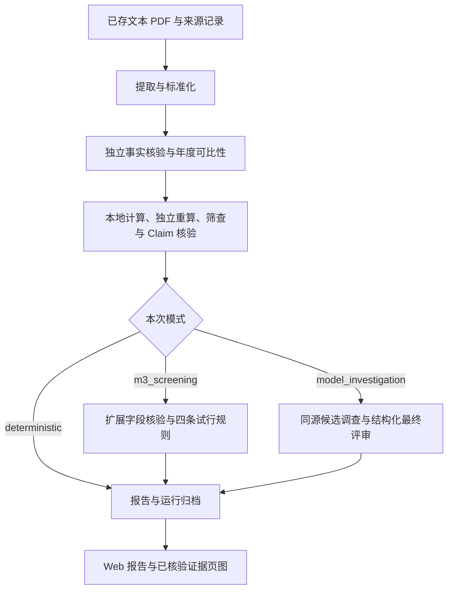

# 架构与模块边界

本文描述当前模块与行为契约，不保存逐次测试流水。能力摘要、启动与配置见 [README](../README.md)，实现里程碑见 [roadmap.md](roadmap.md)，既往结果见 [验收记录](verification-history.md)。计划中的季度分析、历史列表、产品级导出不可写成现有接口。

## 1. 系统与流程

React + TypeScript + Vite 负责本机展示，Python + FastAPI 负责处理与核验。LangGraph 是第一版唯一的智能体编排框架；模型通过后端 Chat Completions 连接器调用，本地 Python 使用 Decimal 计算。项目不内置默认供应方或型号，不含账户系统。

三种模式互斥：deterministic 是默认年度路径；m3_screening 增加扩展字段与四规则；model_investigation 增加候选调查与最终评审。后两者不能在同次 CLI 运行组合。默认路径及四规则不调用模型。

旧年度预检是独立兼容流程：旧事实、旧同比、引用坐标金额与单位换算复核、可选 screening。上传与创建预检分步，不能把旧预检复核描述为 v2 独立事实核验。类型风险见 [历史字段审计](current-schema-audit.md)。

## 2. 模块职责

后端模块位于 `backend/src/finagent/`。

| 模块 | 职责与边界 |
| --- | --- |
| api | 上传、任务队列、设置、能力状态、归档读取及页图；编排现有 CLI，不堆放财务公式 |
| ingestion | 读取文本型 PDF，定位指标、期间、单位/币种、口径与证据；不执行 OCR |
| schemas | 旧 FinancialFact 与隔离的 v2 事实、TableCellEvidence、计算、核验、Claim 类型 |
| verification | 独立重读原文、检查行列与字段、年度可比性、重算、支持依据；缺证据时弃权 |
| finance | Decimal 公式、年度差额/增长率、确定性候选与 M3 试行规则 |
| retrieval | 当前同源年报的正文/附注片段检索，绑定来源哈希、页码、坐标、证据 ID，并限制数量与字符数 |
| agents | LangGraph 候选调查及有限补充检索；调查后结构化最终评审；不把模型意见升级成独立核验 |
| tools | 将已有业务能力适配为工具，不复制解析、计算或核验实现 |
| llm | 同步 Chat Completions 纯文本连接器；请求限共有字段，常规默认超时 60 秒 |
| audit | 模型请求与结果的脱敏调用记录、时间及状态；记录失败不能伪装为审计成功 |
| reports | 组装 JSON 与 Markdown，保留失败/缺口、来源与可选 model_review |
| core | 公共路径、配置、异常等基础能力 |

前端 `pages` 组织年度分析、设置和旧预检；`components` 承载公共组件；`api` 处理请求及错误；`types` 定义读取类型；`styles` 管展示。财务计算和模型调用不在浏览器执行。未来拆分页面应保留现有报告读取、任务恢复与旧归档兼容。

## 3. HTTP 与任务契约

浏览器通过 Vite 的 `/api` 代理访问下列后端路由：

| 路由 | 行为 |
| --- | --- |
| POST /v1/text-pdf-uploads | multipart PDF、company_id、report_year；上限 32 MiB；新建 raw/processed 文件，不覆盖旧输入，不自动开始分析 |
| POST /v1/annual-prechecks | 创建旧预检 |
| GET /v1/annual-prechecks/{run_id} | 读取旧预检归档 |
| POST /v1/annual-analysis-jobs | 以已存来源创建 deterministic / m3_screening / model_investigation 任务 |
| GET /v1/annual-analysis-jobs/{job_id} | 查询阶段、状态、结果 run_id / result_url |
| GET /v1/annual-analyses/{run_id} | 只读已归档的 v2 报告 |
| GET /v1/annual-analyses/{run_id}/evidence/{evidence_id}/preview.png | 已核验证据白名单页图 |
| GET /v1/annual-analysis-capabilities | 仅返回模型模式是否可用与 ready / not_configured / dependency_unavailable |
| GET / PUT / DELETE /v1/model-settings | 读取非密钥状态、保存完整本机配置、清除配置 |
| POST /v1/model-settings/test | 按草稿真实测试连接，不保存草稿、不发送年报 |

任务校验 `source_pdf_path` 相对 data/raw 的范围、符号链接、公司/年度/文档目录、source.json 身份及 SHA256；同时接收 company_id、report_year、document_id、sha256、mode。上传请求中的公司/年度不等于已从 PDF 独立确认的身份。

有界队列为单进程最多一个运行任务、三个排队任务。job.json 写入 `artifacts/annual-analysis-jobs/<job_id>/`；服务重启时遗留 queued/running 转为 interrupted。状态为 queued、running、completed、completed_with_issues、failed、interrupted。模型配置或 LangGraph 未就绪时创建模型任务返回 503。

Web 模型任务按 README 的本机文件优先/环境回退规则注入配置；deterministic 与 M3 子进程移除 MODEL_*。CLI 仍只读环境。设置读取 API 不回显密钥并禁止缓存；设置路由检查 loopback Host，修改与测试还检查本机 Origin。这些是设置路由的约束，不代表所有 API 有相同防护。应用不全局强制 host，按启动命令绑定 127.0.0.1。

上传失败且无可提取文字时返回 422，只撤回该次新建文件。原始文件名、绝对路径或密钥不得进入处理说明。旧资料与归档不可回写。

## 4. 财务与证据契约

解析保留文档标识、原始 SHA256、PDF 的 1-based 物理页序号、文字块和未旋转坐标；坐标原点左上，单位为 PDF point。旋转后 page.rect 的宽高不能直接套用未旋转块坐标。无文字页明确为空，不猜 OCR 结果；加密/损坏 PDF 报错。

v2 事实核验重新打开原 PDF，检查金额、年度列、期间角色、币种、单位与报表口径；不能把提取器自带坐标或重复使用同一提取值当作独立证据。事实状态为 verified、conflict、insufficient_evidence。财务事实字段与来源要求详见 [数据规则](data-policy.md)。

年度计算需要可比性依据；unknown 不默认可比。当前海天 proof 基于同一 2024 年报第 116、163、197 页，未与单独披露的 2023 年报独立勾稽。proof 绑定来源与期间，由当前进程签发；序列化副本仅供审计，不能在后续进程重建授权。比较期基数非正时保留可支持的差额，增长率弃权。

M3 使用应收账款净额、存货净额、合并净利润、营业成本、扣非归母净利润等扩展事实。四条试行规则为：

| 规则 | 触发条件 |
| --- | --- |
| 利润与现金流 | 合并净利润 > 0，经营现金流净额 < 0 |
| 扣非影响 | 归母净利润 > 0，abs(归母净利润 − 扣非归母净利润) / 归母净利润 ≥ 30% |
| 应收偏离 | 应收账款净额增速 − 营业收入增速 ≥ 20 个百分点 |
| 存货偏离 | 存货净额增速 − 营业成本增速 ≥ 20 个百分点 |

每条触发计 25 分；任一规则不可计算，总分为 None，不把部分结果按完整总分展示。阈值未经隔离评测校准，分数不是风险概率或舞弊结论。Markdown 计算值最多显示六位小数，JSON 保留 Decimal 原值，规则在舍入前判断。

输入必须唯一、同公司同源、单位/币种/期间角色及口径相容，逐条独立核验；提取与核验 evidence ID 不重叠。筛查接收同一进程 verify_financial_fact 的直接结果。VerificationResult 本身不是签名 proof，手工重建对象或反序列化 JSON 不能用来证明已核验。

扣非归母净利润来自“主要会计数据”，保持 statement_type=key_financial_data、scope=unknown，排除同比百分比栏。规则二只对海天 603288 的 2024 年报第 7 页版式建立专属映射：核验器重定位“归属于上市公司股东的净利润”，与合并利润表归母净利润逐年对值后签发 proof；绑定源哈希、document_id、报告年、两年相关 fact ID/值与重定位区域。其他公司/期间不套用此证明。non_recurring_total 是披露合计，不是扣非归母净利润；其显式单位副本只供审计，不输入规则。

Claim 类型为 fact、calculation、inference、hypothesis；同比属于 calculation。确定性 Claim 检查只覆盖已实现类型与支持依据，不泛化为模型自由文本语义核验。原文出处和引用 ID 存在，也不证明因果关系。

## 5. 模型、报告与展示

调查只用本次来源清单中的年报片段，补充检索最多一次，不开放任意互联网检索或读取评测标签。候选解释和最终评审通过同一审计连接器调用；最终评审额外进行一次结构化调用。

`config/prompts/annual_investigation_v1.md` 与 `annual_review_v1.md` 是运行时提示词，分别由对应 agents 模块读取。输入文本按待分析数据处理。最终评审提示词禁止复述数字事实，解析器还拒绝含数字的评审文本；页面需要展示数值时应从已核验结构化记录取值。改变此限制须同时修改并验证输出契约，不能仅改 Markdown 措辞。

审计目录为 `artifacts/runs/<run_id>/` 的 UUID 子目录，联网前写 request.json/started，成功写 response.json，失败写安全类别；凭据须脱敏，不记录请求头、base_url 或异常原文。响应审计写入失败抛 AuditPersistError，不返回审计成功；输出归档仍需独立检查是否可能夹带敏感信息，不能据一个脱敏环节推定整条链路安全。

model_review 为可选报告字段，含 completed/failed/not_called 状态、assessment、理由、依据 ID、后续核查、限制及调用审计。assessment 可为 prioritize_review、no_priority_issue_identified_within_scope、insufficient_evidence。观点校验不等同独立事实/语义核验；评审失败仍保留确定性报告并暴露问题，旧报告无此字段仍可读。

同源、独立核验通过且命中白名单的证据可预览 PDF 页图。未核实提取位置标“待核实定位”，没有可靠页码则标“原文位置待定位”；不能用页码改变对象核验状态。浏览器只保存活动 job_id 并支持按 run_id 回看，不等于完整任务历史或 URL 路由已实现。

## 6. 文件与交付

目录归属遵循 [AGENTS](../AGENTS.md)和[数据规则](data-policy.md)。frontend/backend 的依赖与构建配置各自归属工程目录；config 管提示词与规则；scripts 管可复用操作；tests 管正式测试；evaluation 管隔离标签；submission 管阶段性比赛材料。临时内容就近进入 tmp/<task_id>/，默认保留，正式功能不依赖临时文件。

本文不维护安装快照或测试计数；依赖来源见 [dependencies.md](dependencies.md)，历史验证见 [verification-history.md](verification-history.md)。计划书、视频交接和最终成品按 [产品路线](product-delivery-roadmap.md)分别验收。
