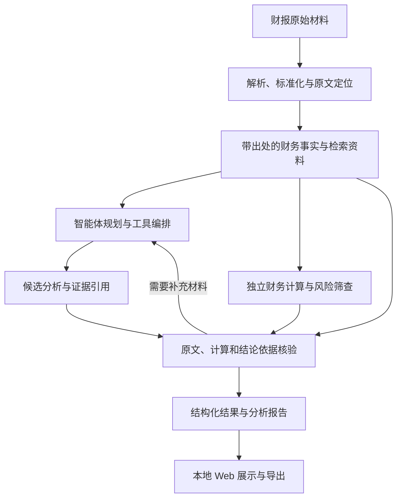

# 架构与模块边界

## 1. 当前状态和目标

文本型 PDF 的逐页解析与原文定位已经实现。`finagent.ingestion.parse_text_pdf` 读取文本型 PDF，保留文档标识、原始文件 SHA256、PDF 1-based 页序号、文字块和未旋转页面坐标。空白页与图片页不产生文字，也不执行 OCR。运行依赖为 PyMuPDF，声明在 `backend/pyproject.toml`。

在 `ParsedTextPdf` 上，已能按表标题、年度表头、单位和币种提取四项年度事实，并由 `finance` 对同一指标的报告年与上一年计算差额和同比率。`scripts/extract_annual_facts.py` 读取已有 `text_pdf.json`，可选核对原始 PDF 的 SHA256，并把 `facts.json`、`calculation.json`、`summary.json` 写入新的运行目录。这不是通用财报抽取。该命令不复核引用坐标内的原文金额；这项复核在年度预检中进行，且仍未覆盖年度列、表头口径和完整财报事实。

云端模型目前实现供应方中立的同步 Chat Completions 文本连接器，使用 `MODEL_BASE_URL`、`MODEL_API_KEY` 和 `MODEL_NAME`。请求只含 `model`、`messages` 和 `stream=false`。`finagent.audit.audited_complete_chat` 在此之外把脱敏请求、成功或失败记录写入本次运行目录的 UUID 子目录。默认供应方和型号仍未选定。该包装器尚未接到智能体或年度预检，也未做云端实测。

本地 FastAPI 已提供年度财务预检：`POST /v1/annual-prechecks` 与 `GET /v1/annual-prechecks/{run_id}`。应用本身不强制 host；按文档中的 Uvicorn 命令默认绑定 `127.0.0.1`。项目无用户注册、登录或账户管理，且不在当前项目范围。模型供应方的 API 密钥仍是独立配置，预检不读取它。预检在哈希一致后，从原始 PDF 的引用坐标重新读取金额，并独立复核单位换算。这尚未确认年度列、表头口径或完整财报事实，也不是 Agent 风险判断。新的预检归档包含 `code` 和 `verification`。`annual-precheck-603288-2024-20260923-160938` 没有这两项，保持原样。把同一行空格与负号、括号、千分位一并计入金额边界的正式运行是 `annual-precheck-603288-2024-20260923-165111`。`164542`、`163707`、`163126` 和 `160938` 仍保留。

舞弊或异常分析、检索、完整核验、报告、LangGraph 编排、上传和报告导出仍未实现。本地年度预检页面已有源码。引用坐标内的原文金额和单位换算复核已经实现，但不代替完整核验。下文仍描述这些尚未实现能力的职责边界。

目标是完成财报导入、财务分析、独立计算、证据核验及报告生成，提供财务异常和舞弊风险线索。第一阶段围绕可解释、可计算的财报问题展开，具体公司、行业和模型在开发阶段选定。

第一版方案详见 [修订大纲](../submission/proposal/多智能体协同财务欺诈识别方案总结大纲_修订版.docx)。优先覆盖口径可比的非金融上市公司文本型财报，先完成同比环比、非经常性损益、会计口径变化和利润现金流差异分析，再形成异常线索；特殊金融行业和复杂扫描件暂不纳入通用自动分析承诺。

技术方向确定为“云端 API + 本地轻量 Web + 本地统计计算”：React + TypeScript + Vite 前端、Python + FastAPI 后端在本机运行；LangGraph 作为第一版唯一的智能体编排框架；后端通过 API 调用云端模型。文本连接器兼容 Qwen、DeepSeek、OpenAI 的 Chat Completions 共有子集，具体供应方和型号由环境变量决定，项目没有内置默认值。文本型 PDF 解析使用 PyMuPDF。财务公式、统计筛查与数值核验由本地 Python 执行，第一版不部署或训练本地模型，不要求 GPU。最终展示是本机 localhost Web。先用 `uvicorn finagent.api.app:app --host 127.0.0.1 --port 8000` 启动后端；再由用户在 `frontend/` 安装已声明的 npm 依赖并执行 `npm run dev`。Vite 绑定 `127.0.0.1:5173`，把 `/api` 代理到 `127.0.0.1:8000`。浏览器打开 http://127.0.0.1:5173 。本机已执行 `npm install` 并生成 `frontend/package-lock.json`，`npm run typecheck` 与 `npm run build` 已通过。开发服务上的浏览器验收覆盖首页、海天 2024 样例创建、按 `run_id` 回看和错误提示，创建记录为 `annual-precheck-603288-2024-20260923-192840`。克隆后仍需自行安装依赖。浏览器不持有模型密钥。

原始文件、解析结果、检索索引和审计记录保存在本地。云端请求只携带允许外发且与任务有关的证据片段；第一版检索限定本次运行的材料清单，不开放任意互联网检索。模型端点、调用预算、超时和重试上限在实现时配置。现场云端 API 访问是否允许仍待组委会环境说明核实，历史回放不得作为实时处理能力的证明。

## 2. 数据流

- 智能体根据任务检索正文、附注和结构化事实，并调用已有工具。
- 财务计算使用带来源的结构化数据和可复现公式；不能依赖大模型在自然语言中给出的计算结果。
- 核验需要回到原始出处。不同模块复用同一个错误提取值时，数值一致不能证明其正确。
- 独立核验是报告生成前的必经节点，分别检查原文数字、程序重算、引用支持程度和模块冲突；逐项返回“通过、存在冲突、证据不足”。再次调用同一个计算函数只属于回放，不替代独立公式检查及原文核对；第二次模型评价仅作辅助。
- 可以通过补充材料解决的问题进入有上限的重新检索与核验循环；达到上限、原文不可读或关键口径仍冲突时转人工复核。未解决的主张不能写为已核实结论，报告保留缺口和失败状态。
- 证据不足、提取失败或口径冲突应在结果中明确暴露，避免强行生成确定结论。
- 文件访问、工具调用、计算、核验与输出环节均由 audit 记录，运行记录按 run_id 归档。
- 事实、推论、观点及待核查事项需要区分，统计信号不能直接作为确认舞弊的判定。

## 3. 前端与后端职责

前端仅负责交互和展示，不保存服务端模型密钥或实现独立的财务计算口径。

| 前端目录 | 职责 |
| --- | --- |
| frontend/public/ | 正式静态资源 |
| frontend/src/pages/ | 目前只有年度预检页面。上传、任务进度和报告导出尚未实现 |
| frontend/src/components/ | 公共界面组件 |
| frontend/src/api/ | 与后端的请求、响应及错误处理 |
| frontend/src/types/ | 前端数据类型 |
| frontend/src/styles/ | 页面及公共样式 |

后端业务代码位于 backend/src/finagent/：

| 模块 | 职责与边界 |
| --- | --- |
| api | 本地 HTTP 接口，不直接堆放分析公式。已实现年度预检的创建和按 run_id 读取；上传进度和报告导出尚未实现。项目不包含用户注册、登录或账户管理 |
| agents | 使用 LangGraph 组织任务规划、检索和工具编排，强制经过独立核验节点并限制补充核查次数 |
| ingestion | 文档解析、字段提取、单位与报告口径标准化，保留原文位置。已实现文本型 PDF 逐页文字，以及四项年度事实提取；其他字段和完整口径标准化尚未实现 |
| retrieval | 正文、表格、附注和事实检索，返回来源信息 |
| tools | 将已有解析、检索、计算等能力适配为智能体可调用工具，避免复制业务实现 |
| finance | 确定性指标计算、财务规则、统计筛查与候选风险评分。已实现四项事实的年度差额和同比率；风险评分和阈值判断尚未实现 |
| verification | 原文、字段、公式、引用及结论证据的核验。已实现按原始 PDF 引用坐标复核金额，并用独立 Decimal 复核单位换算；尚未独立确认年度列、表头口径或完整财报事实 |
| reports | 从结构化结果组织报告和导出内容，保留证据及限制条件 |
| schemas | 文档、财务事实、证据、分析任务和结果等共用类型。已实现文本型 PDF 解析结果和四项年度财务事实；证据、任务和分析结果类型尚未实现 |
| llm | 后端云端模型 API 连接。已实现同步 Chat Completions 纯文本调用。候选根地址见 README，北京和新加坡使用工作空间专属域名，协议限于三家共有字段。云端实测和智能体接入尚未实现 |
| audit | 文件访问、工具调用、计算及生成过程记录，处理敏感凭据。已实现 `audited_complete_chat`：调用方提供 `artifacts/runs` 的直接子目录、带 `document_id` 与 PDF 页码的 `evidence_refs`、`prompt_version`。联网前写入 `started`，成功写入 `succeeded`，失败只写安全类别。不记录 `base_url`、请求头或异常原文。尚未接入预检、智能体或云端实测 |
| core | 配置、路径、公共异常等基础能力 |

依赖清单和构建配置分别归属 frontend/ 和 backend/。`backend/pyproject.toml` 已声明 PyMuPDF、FastAPI 和 Uvicorn，测试可选依赖包含 httpx。`frontend/package.json` 已声明页面依赖的精确版本，本机 `npm install` 已生成 `frontend/package-lock.json`。`node_modules` 不纳入 Git。LangGraph 仍是后续唯一智能体编排框架，当前依赖中没有它。

## 4. 其他目录的职责

| 目录 | 职责 |
| --- | --- |
| config/prompts/ | 可版本化的提示词 |
| config/rules/ | 财务规则、阈值、适用条件和计算口径配置 |
| data/raw/ | 保持原样的原始输入 |
| data/processed/ | 解析文本、表格、标准化事实和可重建索引 |
| data/samples/ | 具备明确来源和使用条件的演示样例 |
| artifacts/runs/ | 按运行归档的输入引用、执行记录与必要中间结果 |
| artifacts/reports/ | 生成的报告与导出 |
| artifacts/evaluations/ | 评测运行结果 |
| evaluation/cases/ | 案例清单、人工标注与评测标签 |
| evaluation/baselines/ | 仅大模型、仅规则或统计模块等对照评测实现 |
| tests/unit/ | 单模块测试。已覆盖文本型 PDF 解析、四项事实提取和年度同比；核验规则测试随核验模块编写 |
| tests/integration/ | 解析、检索、计算、核验等协作测试 |
| tests/e2e/ | 上传到报告输出的完整流程测试 |
| scripts/ | 可复用的工程操作脚本 |
| submission/proposal/ | 初赛计划书及可编辑源文件 |
| submission/video/ | 视频脚本及提交视频 |
| submission/final/ | 决赛报告及最终交付材料 |

模块内临时内容进入所属目录的 tmp/<task_id>/；跨模块临时内容进入 artifacts/tmp/<task_id>/。已有临时目录和文件默认保留，任务结束不主动清理。正式流程不依赖临时目录。

## 5. 接口与类型的规划边界

已实现的业务类型包括文本型 PDF 解析结果和四项年度财务事实，分别在 `backend/src/finagent/schemas/text_pdf.py` 与 `financial_fact.py`。已有的 HTTP 路由只有本地年度预检。尚未新增数据库，也没有证据类型或 Agent 任务类型。

年度预检的创建、按 run_id 读取和页面展示已经接上现有接口。文件导入、任务进度和报告导出仍未实现。

财务事实至少需要表达原始出处、数值、单位、币种、报告期和报表口径；核验结果需要表达检查对象、依据与状态。确切类型定义集中在 schemas，避免各模块各自维护不一致的字段。

## 6. 开发与验证顺序

软件开发范围是可运行系统、数据、核验和复现说明。初赛计划书 PDF 和项目介绍视频 MP4 不在本开发任务内。`submission/` 仍保留比赛材料；比赛对计划书和视频的客观要求不变。本文不指定这些材料的完成人，已有比赛资料保持原样。

1. 文本型 PDF 的逐页文字与坐标已实现，并已用公开年报样例做过定位验收。
2. 四项年度事实、确定性同比，以及引用坐标内的原文金额复核已实现。完整核验仍未实现。
3. 模型与编排：验证调用记录、证据引用和不足信息的处理。
4. 本地年度预检接口和本机预检页面已在开发服务上验收。按文档先启动绑定 127.0.0.1 的后端，再安装前端依赖并启动 Vite。上传和报告导出仍未实现。项目不包含用户注册、登录或账户管理。
5. 评测与复现说明：使用相同输入比较各方案，记录准确性、查准率、召回率、引用正确性和稳定性。

文本型 PDF 解析、四项事实提取、年度同比、原文金额复核和预检 API 由 `tests/unit` 覆盖。提取与接口测试使用合成文字块或临时文件，不把真实财报写进测试。公开年报的运行产物放在 `artifacts/runs/`。前端没有单独的自动化测试套件；2026-09-23 已在本机运行 `npm run typecheck`、`npm run build`，并用浏览器验收开发服务上的预检页面。完整核验仍未实现。
